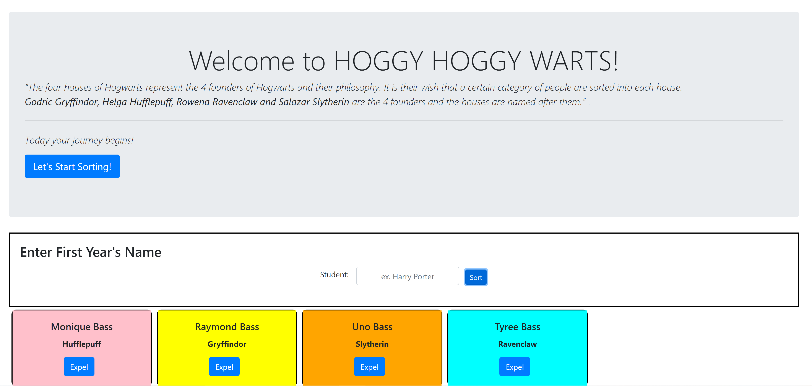

# Sorting hats
## Description
 This project was the continuation of creating cards using div and containers. We added using bootstrap features such as the jumbtron, forms, and buttons. We also expanded our functions to include using the splice method. On this lesson we learned how to pull data and read and write using the document.getElementById method.
## screenshots

## How to run
1. Clone down this repo
1. Make sure you have http-server installed via npm. If not get it [HERE] (https://www.npmjs.com/package/http-server)
1. On your command line run `hs -p 9999`
1. In your browser go to http://localhost:9999
